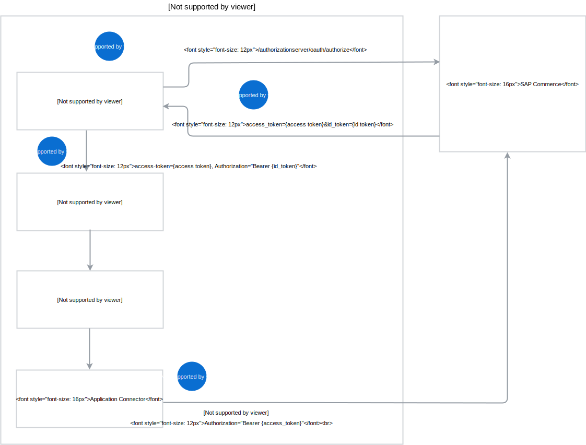

# Lambda that calls Omni Commerce Connect (OCC) API in the context of the end user

## Overview

This example shows how to call an OCC API and integrate with SAP Commerce.

The following diagram illustrates how the web application included in the example interacts with SAP Commerce and the lambda function to call the OCC API in the context of a specific user.


The flow of operations is as follows:
1. The Web UI application redirects the user to SAP Commerce to perform authentication.
2. SAP Commerce redirects the user to the Web UI. The access token and the ID token are passed as query parameters.
3. The Web UI application calls the lambda using the access token and the ID token. The access token is passed in the **occ-token** custom header, whereas the ID token is passed in the **Authorization** header.
4. The Application Connector uses the access token to call the OCC API.    

## Prerequisites

To follow this example, you need:

- A Namespace to which you deploy the example with the env: "true" label. For more information, read the [related documentation](https://github.com/kyma-project/kyma/blob/master/docs/kyma/docs/011-details-namespaces.md).

>**NOTE:** Execute all commands in this example against the Namespace you use (-n {Name_Of_The_Namespace}).

- an OCC API registered in the Application Connector's Registration API.

## Installation

This section describes how to deploy, expose, and call the lambda function you deployed.

### Deploy the lambda function

1. Before you deploy the lambda, modify the [`call-ec-function.yml`](call-ec-function.yml) file by setting the `name` container environment variable value to the full address of the access service that represents the underlying OCC API. See the example for the access service with the `http://ec-default-b515fe5b-7d06-446d-858f-db0128792bb8.kyma-integration` address:  

```
containers:
- env:
  - name: http://ec-default-b515fe5b-7d06-446d-858f-db0128792bb8.kyma-integration
    value: target_url
```

2. To deploy the lambda function in the Namespace of your choice, run this command:
```
kubectl apply -f ./call-ec-function.yml
```

3. To check if the lambda function is successfully created in the Namespace of your choice, run this command:
```
kubectl describe function/calculate-promotion
```

### Expose the lambda function

1. Expose the lambda function. Specify the Namespace to which you deployed the lambda. Run this command:
```
kubectl apply -f ./expose-ec-function.yml
```

### Deploy the Web UI application

1. Edit the [`web-ui/.env`](web-ui/.env) file and set addresses appropriate for the SAP Commerce instance for
   **REACT_APP_OAUTH2_ISSUER**, **REACT_APP_OAUTH2_JWKS_URI**, and **REACT_APP_OAUTH2_AUTHORIZE_URL**.
   For most installations, only the `mycommerce.kyma.cx` domain has to be replaced with the domain of the SAP Commerce instance.

1. Deploy the Web UI application in the Namespace of your choice, and create a Kubernetes service and an Api resource for it:

  ```bash
  kubectl apply -f ./web-ui/deployment.yaml
  ```

1. Expose the Web UI application:

   1. Check the name of the Web UI application Pod. The name starts with `call-ec-web-ui-`.

      ```bash
      kubectl get pods
      ```

   1. Forward the Web UI application port to enable the application on the same port of localhost.

      ```bash
      kubectl port-forward {Pod_Name} 3000
      ```

### Call the lambda

The lambda function expects these query parameters:

- **user-id** which is an identifier of a SAP Commerce user.
- **threshold** which is a minimal value of ordered items needed to get a promotion.

After you expose the function, you can invoke it by sending this request:

```bash
curl -i -G https://calculate-promotion.{YOUR.CLUSTER.DOMAIN} -d "user-id={customer_id}" -d "threshold=1000" -H "occ-token: {EC_access_token}" -H "Authorization: Bearer {EC_ID_token}"
```

### Use the UI

To access the UI, go to `http://localhost:3000` and authenticate in SAP Commerce. After you authenticate, the system redirects you back to the Web UI application.
Find the access token and the ID token issued for your application by SAP Commerce in the **Authentication** section. Expand **The Function** section to call the function and check the results of the operation.

### Cleanup

Use this command to delete all objects created by the example:
```bash
kubectl delete all -l example=call-ec
```

## Troubleshooting

### Lambda returns an Internal Server Error

An Internal Server Error can occur in one of the following situations:
- You don't specify the required query parameters when you invoke the lambda.
- You don't set the correct address of the access service that represents the underlying OCC API in the [`call-ec-function.yml`](call-ec-function.yml) file.
- The underlying OCC API is not available.
- The underlying OCC API returns a status different than `200`.

Check the logs of the lambda function to troubleshoot the issue.

### Check the log file

Find the Pod that contains the lambda function. Use this command to list all Pods in a given Namespace:
```bash
kubectl get po
```

Get the logs of the chosen Pod:

```bash
kubectl log {Pod_name}
```      
