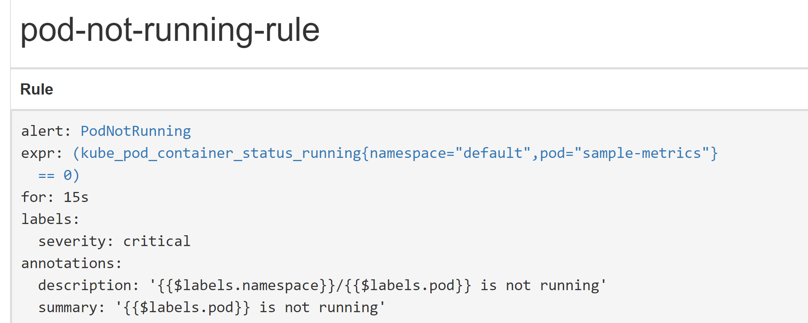
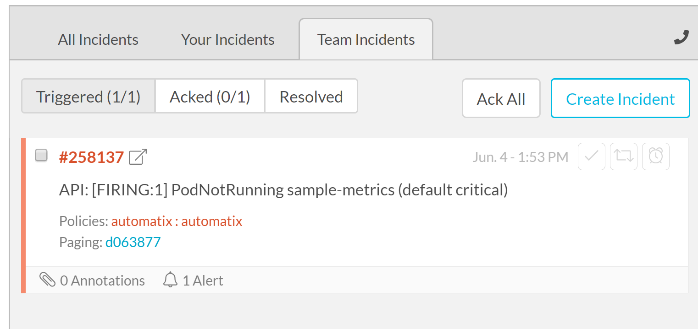
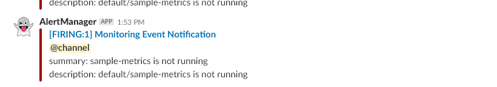
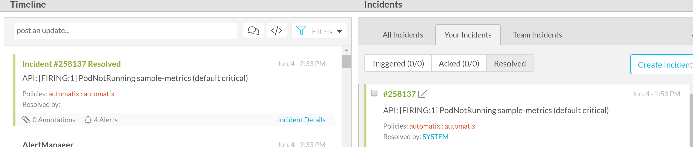
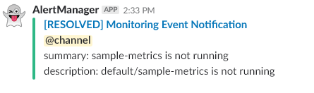

# Alerting Rules Example

## Overview

This example shows how to configure alert rules in Kyma.

1. Define a new alerting rule in Prometheus.
2. Configure Alertmanager to handle alerts.

## Prerequisites

- Review [alert-rules/README.md](https://github.com/kyma-project/kyma/tree/master/resources/core/charts/monitoring/charts/alert-rules/README.md) in Kyma. It is **mandatory** in order to complete the example.
- Review [alertmanager/README.md](https://github.com/kyma-project/kyma/tree/master/resources/core/charts/monitoring/charts/alertmanager/README.md) in Kyma. It is **mandatory** in order to complete the example.
- Kyma as the target deployment environment.
- VictorOps Routing Keys and a Service API Key [Prometheus Integration Guide – VictorOps](https://help.victorops.com/knowledge-base/victorops-prometheus-integration/)

## Installation

1. Edit  [unhealthy-pods-rules.yaml](https://github.com/kyma-project/kyma/tree/master/resources/core/charts/monitoring/charts/alert-rules/templates/unhealthy-pods-rules.yaml) by removing the line comment symbol ```#```
2. Edit [alertmanager/values.yaml](https://github.com/kyma-project/kyma/blob/master/resources/core/charts/monitoring/charts/alertmanager/values.yaml) to enable the victorOps (and/or) slack integration. **You will have to replace some data such a tokens and urls with your configuration**.
3. Run Kyma followed by the kubectl command to access prometheus dashboard.
    ```$ kubectl port-forward pod/prometheus-core-0 -n kyma-system 9090:9090```
    In [http://localhost:9090/rules](http://localhost:9090/rules), you will find the rule, **pod-not-running-rule**.
    

4. After Kyma in fully running we should start to receive alerts in VictorOps or Slack.
- VictorOps


- Slack


**Review you configuration if the alerts are not received after the expected time. You also should Validate ```alertmanager/values.yaml``` files.**

5. Create the required pod sample-metrics to solve the issue.

```bash
$ cd /examples/monitoring-alert-rules/k8s/
$ kubectl apply -f lambda-function.yaml
```
- VictorOps

- Slack


### Cleanup
Run the following command to completely remove the example and all its resources from the cluster:

```bash
# notice that you do not need to indicate the Namespace, as the system created the resources using 'default namespace'
kubectl delete all -l example=monitoring-alert-rules
```
