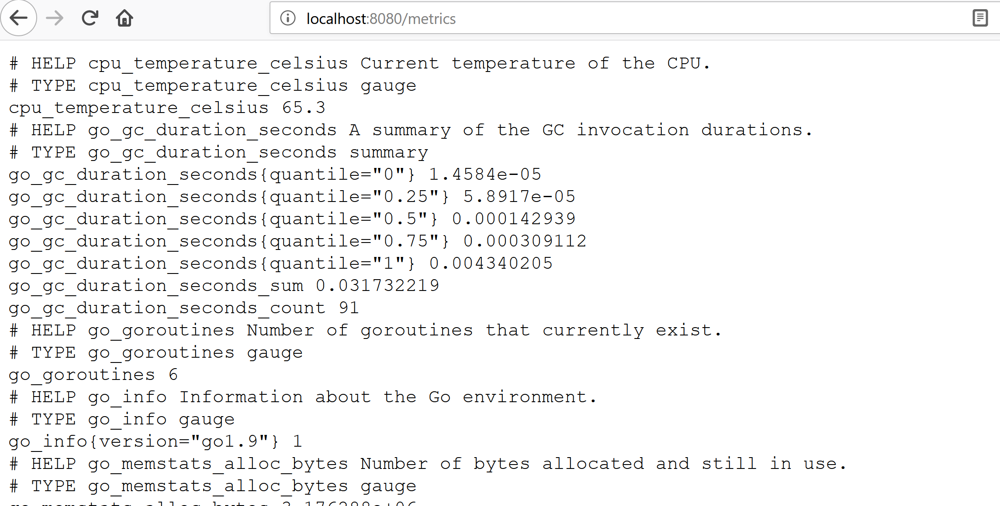

# Expose Custom Metrics in Kyma

## Overview

This example shows how to expose Prometheus metrics with golang from inside of a istio service mesh and monitoring that service from outside of the mesh with Prometheus.

1. Configure Istio
2. Expose a sample metrics application serving metrics on Port 8081.
3. Access the exposed metrics in Prometheus

## Prerequisites

- Kyma as the target deployment environment.
- Istio 0.8
  - Sidecar injection must be enabled ```istio-injection: "enabled"```
  - Mutual TLS enabled.

## Installation

### Configure Istio

#### Sidecar injection must be enabled, ```istio-injection: "enabled"``` for namespace "default".

In Kyma sidecar injection is enabled for the namespaces **kyma-system** and **kyma-integration**.

To enable sidecar injection for all the pods running in namespace ***default*** run the command below.

```bash
$ kubectl label namespace default istio-injection=enabled
namespace "default" labeled
 ```
- [Istio reference documentation - Deploy your application](https://istio.io/docs/setup/kubernetes/quick-start#deploy-your-application).

It is needed to add the sidecar.istio.io/inject annotation with value true to the pod template spec to enable injection. Do this in your Deployment yaml.


```yaml
spec:
  template:
    metadata:
      annotations:
        sidecar.istio.io/inject: "true"
```

- [Installing the Istio Sidecar](https://istio.io/docs/setup/kubernetes/sidecar-injection/#policy).


#### 8081, the excluded port for metrics

Istio 0.8 provides a way to include those inbound ports to be redirected to Envoy.

Envoy will capture only traffic on ports listed in containerPorts of the pod, `containerPort: 8080`, or the list of ports in the annotation "traffic.sidecar.istio.io/includeInboundPorts".

In Kyma port ***8080*** is used by the [Kubeless lambda functions](../event-subscription/lambda/README.md), therefore needs to be included in the inbound ports list.

```yaml
spec:
  template:
    metadata:
      annotations:
        traffic.sidecar.istio.io/includeInboundPorts: "8080"
```

**All other traffic bypasses Envoy** and goes straight to the container. In Kyma, use the suggested port 8081 to expose metrics.

### Expose a sample metrics application

In order to expose prometheus metrics in golang the prometheus community provides a library, [client_golang ](https://github.com/prometheus/client_golang).

This example has taken a basic example where Gauge and Counter metrics are exported using the package prometheus.

1. Build Docker Image
    ```bash
    # (linux, mac) users
    $ eval $(minikube docker-env)

    # windows user powershell
    > & minikube docker-env | Invoke-Expression

    $ kubectl config use-context minikube

    $ cd examples/monitoring-custom-metrics

    $ docker build -t sample-metrics-app -f Dockerfile .

    ...
    Successfully built b41158be6124
    Successfully tagged sample-metrics-app:latest
    ```
[Dockerfile here](Dockerfile)

2. Deploy sample-metrics-app
    ```bash
    $ kubectl apply -f k8s/sample-metrics-app.yaml
    service "metrics-8080" created
    service "sample-metrics-8081" created
    deployment.extensions "sample-metrics" created
    servicemonitor.monitoring.coreos.com "metrics" created
    ```

    ```bash
    $ kubectl get pods
    NAME                             READY     STATUS    RESTARTS   AGE
    sample-metrics-c9f998959-jd2fz   2/2       Running   0          2m
    sample-metrics-c9f998959-kfbp8   2/2       Running   0          2m
    sample-metrics-c9f998959-nnp2n   2/2       Running   0          2m
    sample-metrics-c9f998959-vdnkn   2/2       Running   0          2m
    ```

    Afterwards, run the command below to see the `istio-sidecar-injector` configmap configuration, and the annotations described above should be present.

    ```bash
    $ kubectl describe configmap istio-sidecar-injector -n istio-system
    ```

    ```bash
      sidecar.istio.io/inject: "true"
      traffic.sidecar.istio.io/includeInboundPorts: "8080"
    ```

3. Run the port-forward on sample-metrics-c9f998959-jd2fz
    ```
    $ kubectl port-forward sample-metrics-c9f998959-jd2fz 8080:8080
    ```
    
4. In another terminal, run the port-forward on sample-metrics-c9f998959-jd2fz but now for port 8081
    ```
    $ kubectl port-forward sample-metrics-c9f998959-jd2fz 8081:8081
    ```
    

So sample-metrics is exposing metrics in two ports. [Here, sample_metrics.go](go/sample_metrics.go) source code.


- The reference documentation of the [package prometheus](https://godoc.org/github.com/prometheus/client_golang/prometheus).

- Official prometheus documentation of [metric types](https://prometheus.io/docs/concepts/metric_types/).

#### Access the exposed mentrics in Prometheus

Run the port-forward on prometheus-core-0 which is the Prometheus server running in Kyma.
```bash
$ kubectl port-forward pod/prometheus-core-0 -n kyma-system 9090:9090
Forwarding from 127.0.0.1:9090 -> 9090
Forwarding from [::1]:9090 -> 9090
```
You will see in **target** all the **sample-metrics** endpoint. **sample-metrics-8081** is the name of the Service discovered by the **ServiceMonitor**


#### ServiceMonitor

Prometheus is able to reach the service thanks to the ServiceMonitor which has been created together with the sample metrics application. A ServiceMonitor is a specific CRD used by the prometheus operator to monitor services.

In Kyma the prometheus server discovers all ServiceMonitor through a ```serviceMonitorSelector:``` matching the label ```prometheus: core```

```yaml
  serviceMonitorSelector:
    matchLabels:
      prometheus: {{ .Values.prometheusLabelValue | default .Release.Name | quote }}
{{- end }}
```


In our example and at the same way, the ServiceMonitor selects, ```selector:```, all Service matching a label, ```k8s-app: metrics``` and target the label.

- [Service and ServiceMonitor](k8s/sample-metrics-app.yaml)

In Kyma we have a template, [kyma/resources/core/charts/monitoring/charts/prometheus/templates/servicemonitors.yaml](https://github.com/kyma-project/kyma/blob/master/resources/core/charts/monitoring/charts/prometheus/templates/servicemonitors.yaml), which is ```kind: List``` to discover a list of ServiceMonitors.

### Adding Custom Dashboard in Grafana

As mentioned, Kyma includes a set of dashboards. However, users can create their own **Grafana Dashboard** by using the Grafana UI as the dashboards are persisted even after the pod restarts.

For details of how to create dashboards in Grafana:
- [Grafana in Kyma](https://github.com/kyma-project/kyma/blob/master/resources/core/charts/monitoring/charts/grafana/README.md)
- [Grafana - Getting started](http://docs.grafana.org/guides/getting_started/)
- [Export and Import dashboards](http://docs.grafana.org/reference/export_import/)
- [Grafana - Dashboard API](http://docs.grafana.org/http_api/dashboard/)

### Cleanup
Run the following commands to completely remove the example and all its resources from the cluster:

- Remove label istio-injection
  ```$ kubectl label namespace default istio-injection-```
- Remove ServiceMonitor in namespace kyma-system
  ```$ kubectl delete servicemonitor -l example=monitoring-custom-metrics -n kyma-system```
- Remove sample-metrics deployments in namespace default
  ```$ kubectl delete all -l example=monitoring-custom-metrics```
